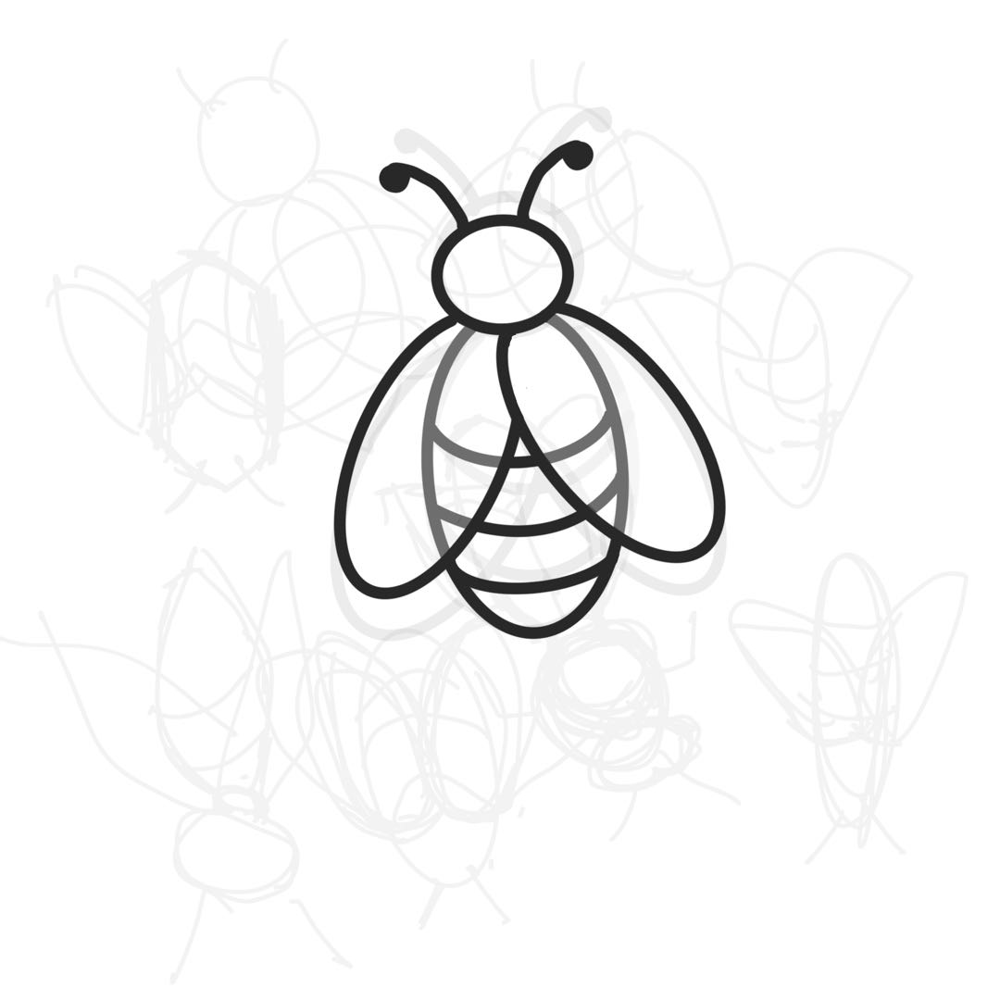

# Honey Toolbox

Computer vision toolbox for agile development

<!-- PROJECT SHIELDS -->

[![Contributors][contributors-shield]][contributors-url]
[![Forks][forks-shield]][forks-url]
[![Stargazers][stars-shield]][stars-url]
[![Issues][issues-shield]][issues-url]
[![MIT License][license-shield]][license-url]
[![LinkedIn][linkedin-shield]][linkedin-url]

<!-- PROJECT LOGO -->
<br />

<p align="center">
  <a href="https://github.com/wengjiangwei/Honey/">
    
  </a>

  <h3 align="center">深度网络-机器视觉-工具箱</h3>
  <p align="center">
    一个"便捷"的开发模板去快速开始你的项目！
    <br />
    <a href="https://github.com/shaojintian/Best_README_template"><strong>探索本项目的文档 »</strong></a>
    <br />
    <br />
    <a href="https://github.com/wengjiangwei/Honey/tree/main/demo">查看Demo</a>
    ·
    <a href="https://github.com/wengjiangwei/Honey/issues">报告Bug</a>
    ·
    <a href="https://github.com/wengjiangwei/Honey/issues">提出新特性</a>
  </p>

</p>

## 目录

- [Honey Toolbox](#honey-toolbox)
  - [目录](#目录)
    - [上手指南](#上手指南)
    - [如何使用](#如何使用)
    - [文件目录说明](#文件目录说明)
    - [开发的架构](#开发的架构)
    - [部署](#部署)
    - [使用到的框架](#使用到的框架)
      - [如何参与开源项目](#如何参与开源项目)
    - [版本控制](#版本控制)
    - [作者](#作者)
    - [版权说明](#版权说明)

### 上手指南
1. Clone the repo

```sh
git clone https://github.com/wengjiangwei/Honey.git
```
2. Development environment
  
- 推荐使用虚拟环境[Conda](https://www.anaconda.com/)

 ```sh
conda create --name Honey_py37 python=3.7
conda activate Honey_py37
```

- 请参考[环境配置文件](https://github.com/wengjiangwei/Honey/blob/main/requirement.txt)

 ```sh
pip install -r requirements.txt  -i https://pypi.douban.com/simple/
```
3. 安装Linux端的latex编译程序(Maybe work or report an error in doc.generate_pdf(compiler='pdflatex')<strong>)
  ```sh
  sudo apt-get install latexmk
  sudo apt-get install -y texlive-latex-extra
   ```
3. Open SMTP server *e.g. xxx@163.com* 

- [参考链接，进行设置](http://help.163.com/09/1223/14/5R7P6CJ600753VB8.html?servCode=6010376*)
  
### 如何使用

1. Train the model with config.yaml file
   ```sh
   cd ./demo
   python train.py --config_path ./demo/config.yaml --email_config ./demo/email_config.yaml
   ```
   😊 推荐使用绝对路径
  - Config.yaml  
   ```sh
    ####PDF_information
    project_version: ft_0.1
    developer: wengjiangwei
    ###### project settings #################################
    PDF_path : ../YOLOV5_PDF
    # type=str, default='...', help:training result file path
    root_path : ../Data/A_Rawdata/ft_AutoXML_729
    # type=str, default='...', help:raw image path that save the XML and JPG files.
    anno_path : ../Data/ft_AutoXML_729
    # type=str, default='...', help:annotations and images folder.
    data : ../Data/ft_AutoXML_729/data.yaml
    # type=str, default='...', help:annotations and images folder.
    class_name : ["ftqx", 'ljdl']
    # type=list,  help:detection classes.
    train_val_prec: 0.1
    # type=float,  default=01, help:train and val samples ratio.
    project_path : ../Runs/v5-test
    # same with project      #TODO:ignore the name
    project : ../Runs/v5-test
    # default='./runs/train', help='save to project/name'
    name : 'ft'
    # type=str, default='exp', help='save to project/name'
    imgsz : 640 
    # type=int, default=640, help='train, val image size (pixels'

    ###### yolo settings #################################
    weights : ../Weights/YOLOV5/yolov5l.pt
    # type=str, default='./yolov5s.pt', help='initial weights path'
    cfg : ./libs/det_module/yolov5_v6/models/yolov5l.yaml
    # type=str, default='', help='model.yaml path'
    hyp : ./libs/det_module/yolov5_v6/data/hyps/hyp.scratch-low.yaml
    # type=str, default='./data/hyps/hyp.scratch-low.yaml', help='hyperparameters path'
    epochs : 10 
    # type=int, default=300
    batch-size : 8 
    # type=int, default=16, help='total batch size for all GPUs, -1 for autobatch'
    device : ''
    #  default='', help='cuda device, i.e. 0 or 0,1,2,3 or cpu'
    optimizer : 'SGD'
    #  type=str, choices=['SGD', 'Adam', 'AdamW'], default='SGD', help='optimizer'
  ```
- Email_config
```sh
  user: XXXXXX@163.com
  password: XXXXXXXXXXXX
  port: 'smtp.163.com'

  recipient: XXXXX@163.com
  email_title: YOLOv5 training report
  email_content: Please see the attachment file for more information
```
2. Detect the images with detect.yaml file
   ```sh
   python detect.py --config_path ./demo/detect.yaml --email_config ./demo/email_config.yaml
   ```
  Detect config
```sh
#####project name#########################################
project_version: ft_0.1
developer: wengjiangwei
gt_xml_root : ../Data/ft/testSets/anno
target: ['ftqx','ljdl']

###### project settings #################################
weights: ../Runs/v5-test/ft2/weights/best.pt   # model.pt path(s)
source: ../Data/ft/testSets   # file/dir/URL/glob  0 for webcam
data: ../Data/ft_AutoXML_729/data.yaml   # dataset.yaml path
imgsz: [640,640]  # inference size (height  width)

project: ../Runs/v5-test   # save results to project/name
name: detect  # save results to project/name
PDF_path: ../YOLOV5_PDF


save_txt:  true   # save results to *.txt
save_conf:  true   # save confidences in --save-txt labels
save_crop:  true   # save cropped prediction boxes
save_xml :   true  # XML file
save_fusion_images :  true   # save_fusion_images (image  conf and class)
filter_img :  ~ 
###### yolo settings #################################

conf_thres: 0.25   # confidence threshold
iou_thres: 0.45   # NMS IOU threshold
max_det: 1000   # maximum detections per image
device: ''   # cuda device  i.e. 0 or 0 1 2 3 or cpu
view_img:  false   # show results
nosave:  false   # do not save images/videos
classes: ~   # filter by class: --class 0  or --class 0 2 3
agnostic_nms:  false   # class-agnostic NMS
augment:  false   # augmented inference
visualize:  false   # visualize features
update:  false   # update all models
exist_ok:  false   # existing project/name ok  do not increment
line_thickness: 3   # bounding box thickness (pixels)
hide_labels:  false   # hide labels
hide_conf:  false   # hide confidences
half:  false   # use FP16 half-precision inference
dnn:  false  # use OpenCV DNN for ONNX inference
```
### 文件目录说明
eg:

```
├── Data
│   ├── Rawdata (原始数据集)
│   │   └── ft （举例：数据集1,含XML&JPG）
│   ├── ft （可根据Rawdata-ft文件夹，代码自动生成, it is awesome~, except <testSets folder>）
│   │   ├── Annotations
│   │   ├── images
│   │   ├── ImageSets
│   │   ├── JPEGImages
│   │   ├── labels
│   │   └── testSets (测试数据,含JPG&)
│   │       └── annotations (真实XML标签) 
├── Honey
│   ├── demo
│   │   └── wandb (日志文件)
│   ├── libs
│   │   ├── cls_module
│   │   │   └── models
│   │   └── det_module
│   │       ├── yolov3 (#TODO yolov3)
│   │       ├── yolov5_v6 (V6 means target 6.0)
│   │       │   ├── data (don't delete!)
│   │       │   │   ├── hyps
│   │       │   │   ├── images
│   │       │   │   └── scripts
│   │       │   ├── models
│   │       │   └── utils
│   │       └── yolov7 (#TODO yolov7)
│   ├── metrics
│   ├── tools
│   │   ├── postprocess
│   │   ├── processing
│   └── utils
├── Runs (Project save path)
│   ├── Finished
│   │   ├── FT_v0
│   └── v5-test (For YOLOV5)
│       ├── detect
│       │   ├── bad_case
│       │   ├── crops
│       │   │   ├── class1
│       │   │   └── class2
│       │   ├── detect_fusion_image
│       │   └── labels
├── Weights (pretrained models)
│   ├── Trained_model (Finished model for your works.)
│   ├── YOLOV5
│   └── YOLOV7
└── YOLOV5_PDF (output the report files)

```

### 开发的架构 

请阅读[ARCHITECTURE.md](https://github.com/shaojintian/Best_README_template/blob/master/ARCHITECTURE.md) 查阅为该项目的架构。

### 部署

暂无 

### 使用到的框架

- [YOLOV5](https://github.com/ultralytics/yolov5)

#### 如何参与开源项目

贡献使开源社区成为一个学习、激励和创造的绝佳场所。你所作的任何贡献都是**非常感谢**的。
1. Fork the Project
2. Create your Feature Branch (`git checkout -b feature/AmazingFeature`)
3. Commit your Changes (`git commit -m 'Add some AmazingFeature'`)
4. Push to the Branch (`git push origin feature/AmazingFeature`)
5. Open a Pull Request

### 版本控制

该项目使用Git进行版本管理。您可以在repository参看当前可用版本。

### 作者

 *Waynejoneswjw@gmail.com*

### 版权说明

该项目签署了MIT 授权许可，详情请参阅 [LICENSE](https://github.com/wengjiangwei/Honey/blob/main/LICENSE)


